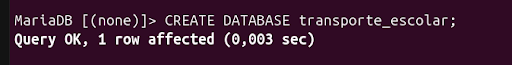
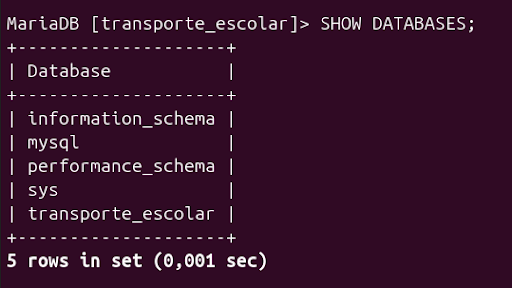

    Evidencia

Objetivo
enternder desde la terminal el proceso de creación de una base de datos, entendiendo conceptos clave como base de datos, tablas, registros y campos, además de aprender a inspeccionar y modificar su estructura.

Problema elegido
Un sistema de Transporte Escolar para organizar los autobuses que trasladan a los estudiantes. Para  registrar las rutas disponibles y los datos del personal de conducción.

Diseño de las tablas
Se crearon  dos tablas principales dentro de la base de datos transporte_escolar:

    rutas: Almacena la información de los trayectos escolares.

    choferes: Almacena la información del personal encargado de las unidades.

Tipos de datos
Se seleccionaron los tipos de datos en función de la información de cada campo:

    INT: Utilizado para números enteros, como los identificadores (id), la capacidad del autobús y los años de experiencia.

    VARCHAR: Utilizado para cadenas de texto de longitud variable, como el nombre de la ruta, el turno, el nombre del chofer, el teléfono y el número de licencia.

Clave primaria
Cada tabla cuenta con un campo id configurado como INT AUTO_INCREMENT PRIMARY KEY. para cada registro (cada ruta o cada chofer) tenga un identificador único.

Comandos utilizados
Durante la práctica se utilizaron las siguientes sentencias SQL en la terminal:

    CREATE DATABASE: Para crear la base de datos desde cero.

    USE: Para seleccionar la base de datos activa.

    CREATE TABLE: Para definir la estructura y campos de cada tabla.

    SHOW DATABASES / SHOW TABLES: Para verificar la existencia de la base de datos y sus tablas.

    DESCRIBE: Para inspeccionar la estructura detallada de las tablas.

    ALTER TABLE: Para modificar el esquema agregando un campo nuevo y renombrándolo posteriormente.

Pruebas
Se utilizo la terminal usando SHOW TABLES para crear las tablas y DESCRIBE rutas; / DESCRIBE choferes; 

Modificación realizada
Para cumplir con el reto de modificar el esquema sin destruir la base de datos, se agregó inicialmente una columna de años de experiencia a la tabla de choferes mediante:
ALTER TABLE choferes ADD COLUMN años_de_experiencia INT;

Resultados
Se obtuvo una base de datos funcional en el servidor de MySQL/MariaDB, en dos tablas independientes con sus campos, tipos de datos correctos, llaves primarias definidas y un esquema modificado con éxito.

Problemas encontrados
Surgió la duda sobre cómo renombrar una columna directamente desde la terminal sin tener que borrar la tabla completa.

Soluciones
Se aplicó el comando ALTER TABLE RENAME COLUMN, lo cual permitió cambiar el nombre del campo.

Reflexión final
ayudo a entender como crear una base de datos,  analizando qué información se necesita almacenar en el mundo real. Además, demostró la importancia de saber utilizar herramientas como DESCRIBE y comandos  como ALTER TABLE para cambiar nombres de las columnas.

CAPTURAS

Terminal con acceso al SGBD.

Captura donde muestro el momento en que inicié sesión correctamente en la terminal de MySQL o MariaDB con mi usuario.

Creación de la base de datos.

Captura donde ejecuto la sentencia CREATE DATABASE transporte_escolar;.

SHOW DATABASES.

Captura donde muestro el listado de las bases de datos del servidor para comprobar que transporte_escolar se creó de forma correcta.

USE.

Creación de la primera tabla.

Creación de la segunda tabla.

SHOW TABLES.

DESCRIBE de las tablas.

Modificación mediante ALTER TABLE.

Verificación final.

