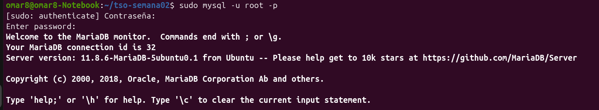
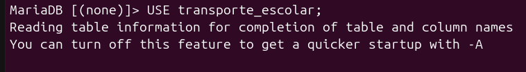
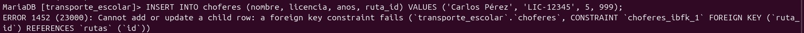
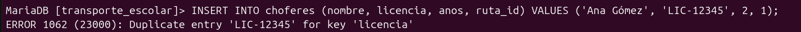
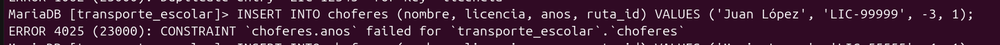
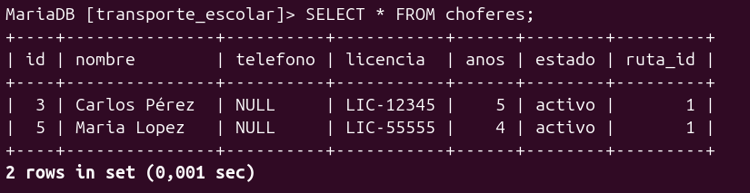
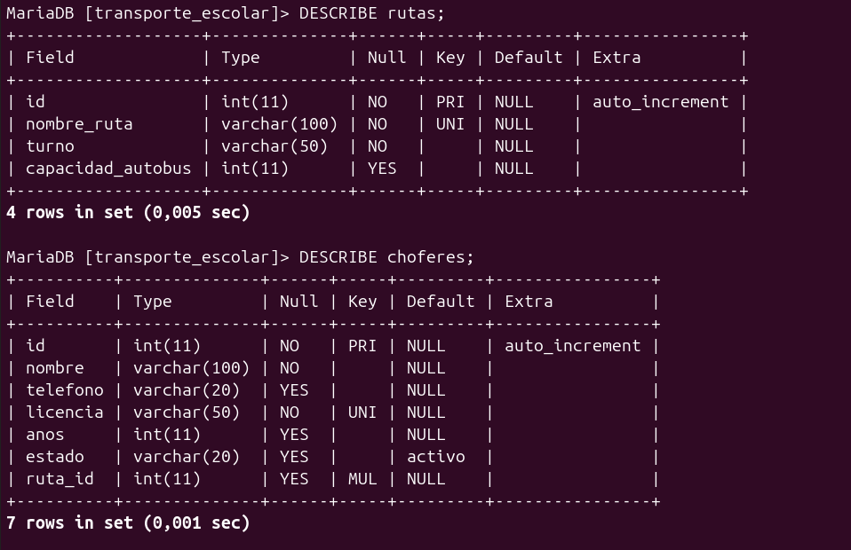
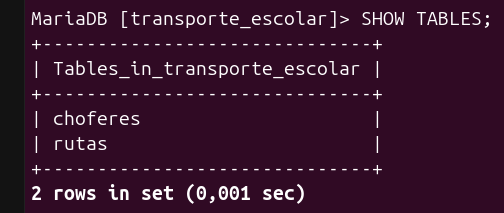

📝 Reporte de Evidencia: Práctica 03
🎯 Objetivo

Comprender, implementar y verificar el funcionamiento de las restricciones (constraints) en una base de datos relacional utilizando MariaDB, con el fin de asegurar que el SGBD rechace automáticamente información inválida, duplicada, nula o inconsistente.

🏫 Problema elegido
Para esta práctica utilicé el proyecto de Transporte Escolar, el cual administra las rutas disponibles y los choferes asignados a cada una de ellas

🧱 Tablas utilizadas
Dos tablas principales dentro de la base de datos transporte_escolar:

    rutas: Almacena la información de los trayectos escolares.
    choferes: Almacena los datos del personal de conducción y se relaciona directamente con la tabla de rutas.

🛡️ Restricciones implementadas
Durante la creación de las tablas, apliqué las siguientes reglas de integridad:

    PRIMARY KEY: Utilizada en el campo id de ambas tablas para garantizar una identificación única por registro de forma autoincrementable.

    NOT NULL: Aplicada en campos obligatorios como nombre_ruta, turno, nombre y licencia para impedir registros vacíos.

    UNIQUE: Establecida en nombre_ruta y licencia para evitar duplicidad de información.

    DEFAULT: Configurada en el campo estado de la tabla choferes con el valor 'activo' para asignarlo automáticamente si no se especifica.

    CHECK: Implementada en capacidad_autobus > 0 y anos >= 0 para validar que los valores numéricos tengan sentido lógico.

    FOREIGN KEY: Aplicada en el campo ruta_id de la tabla choferes, referenciando a rutas(id) para mantener la integridad referencial.

🧪 Pruebas realizadas
Ejecuté una serie de experimentos introduciendo datos incorrectos para comprobar la respuesta de la base de datos:

    Prueba de FOREIGN KEY: Intenté registrar un chofer asignándolo a una ruta inexistente (ruta_id = 999).

    Prueba de UNIQUE: Intenté registrar a dos choferes diferentes utilizando exactamente el mismo número de licencia (LIC-12345).

    Prueba de CHECK: Intenté registrar un chofer con una cantidad negativa de años de experiencia (-3).

    Prueba de DEFAULT: Inserté un registro omitiendo el campo estado para verificar si se completaba automáticamente.

❌ Errores encontrados
Durante la ejecución de las pruebas, el SGBD me devolvió las siguientes respuestas de protección:

    Error de Llave Foránea: Se generó el ERROR 1452 (23000) al intentar insertar una relación que no correspondía con los registros existentes en la tabla padre.

    Error de Duplicidad: El sistema bloqueó la inserción del segundo registro con la misma licencia debido a la restricción de unicidad.

    Error de Condición: El motor rechazó el valor negativo en la columna de años debido a la regla lógica del CHECK.

🧠 Análisis de errores
Los errores obtenidos no representaron una falla en mi código, sino todo lo contrario: demostraron que las restricciones están activas y cumpliendo su propósito.

    El ERROR 1452 me confirmó que una tabla dependiente (child table) no puede aceptar una clave foránea si el identificador no existe previamente en la tabla principal (parent table).

    Las restricciones UNIQUE y CHECK evitaron que ingresara información "sucia" o ilógica que en un sistema real corrompería las estadísticas de operación del transporte escolar.

🛠️ Correcciones

Para solucionar los detalles detectados durante el desarrollo (como el error de sintaxis en el nombre de la columna anos frente a años), ajusté los campos en la definición de la estructura SQL y procedí a ejecutar consultas limpias con datos válidos (ruta_id = 1) para permitir el flujo correcto de inserción.
✅ Resultados

    La base de datos transporte_escolar quedó estructurada formalmente con todas las restricciones requeridas.

    Logré comprobar mediante los comandos DESCRIBE y SHOW CREATE TABLE que las reglas de integridad están firmemente ligadas al esquema de las tablas.

    Las inserciones válidas se completaron con éxito, mostrando el funcionamiento correcto del valor predeterminado (DEFAULT).

📸 Capturas

Muestra la conexión al SGBD y la selección de la base de datos con el comando USE transporte_escolar;

Muestra la conexión al SGBD y la selección inicial de la base de datos con el comando USE transporte_escolar;.

Muestra la prueba de la llave foránea fallida (ERROR 1452) al intentar registrar un chofer asignándolo a una ruta inexistente (999).

Muestra el bloqueo de seguridad del SGBD al intentar registrar a un segundo chofer utilizando exactamente el mismo número de licencia (UNIQUE).

Muestra el rechazo del sistema al intentar introducir un valor numérico negativo (-3) en los años de experiencia mediante la regla CHECK.

Muestra el resultado de la consulta SELECT * FROM choferes; donde se comprueba que el campo estado se rellenó automáticamente con el valor predeterminado 'activo' al omitirlo en la inserción.

Muestra la verificación estructural de las tablas mediante el comando DESCRIBE para comprobar tipos de datos y nulabilidad.

Muestra la verificación avanzada del esquema mediante el comando SHOW CREATE TABLE, visualizando de forma completa todas las reglas de integridad aplicadas.

💭 Reflexión final

Esta práctica me permitió comprender que una base de datos profesional va mucho más allá de simplemente almacenar filas y columnas. Implementar restricciones (constraints) directamente en el motor de la base de datos es una barrera de seguridad indispensable, ya que traslada la responsabilidad de validar la información desde la aplicación hacia el propio SGBD, asegurando que los datos sean siempre confiables, íntegros y consistentes a lo largo del tiempo.
