markdown
# Práctica 05 — Consultas SELECT

## 🎯 1. Objetivo
Comprender y aplicar el comando `SELECT` y sus cláusulas de filtrado (`WHERE`, `LIKE`, `IN`, `BETWEEN`, `IS NULL`, `DISTINCT`, operadores lógicos y de comparación) en MariaDB/MySQL, transformando preguntas de negocio en consultas SQL precisas para extraer información relevante de la base de datos del sistema de transporte escolar.

## 🗄️ 2. Base de datos utilizada
- **Nombre:** `transporte_escolar`
- **Tecnología:** MariaDB / MySQL (ejecutado desde la terminal de Ubuntu)

## 📋 3. Tablas utilizadas
- **`choferes`**: Almacena la información del personal de conducción (identificador, nombre, teléfono, licencia, años de experiencia, estado y relación con la ruta).
- **`rutas`**: Almacena la información de las rutas escolares (identificador, nombre de la ruta, turno y capacidad del autobús).

---

## 🔍 4. SELECT básico
El comando `SELECT` permite consultar registros de una tabla. Utilizando el asterisco (`*`) solicitamos todas las columnas disponibles.

- **Consulta ejecutada:**

    sql
SELECT * FROM choferes;
SELECT * FROM rutas;

* **Explicación:** Devuelve la totalidad de los registros y atributos contenidos en las tablas de la base de datos.

---

## 📊 5. SELECT de columnas específicas

Para optimizar la lectura de los datos y evitar traer información innecesaria, podemos indicar de forma explícita las columnas que necesitamos.

* **Consulta ejecutada:**

    sql
SELECT nombre, licencia FROM choferes;

* **Explicación:** Muestra únicamente los nombres y números de licencia de los choferes, omitiendo el resto de los campos.

---

## 🔎 6. WHERE

La cláusula `WHERE` actúa como un filtro que permite recuperar únicamente los registros que cumplen con una condición específica establecida.

* **Consulta ejecutada:**

    sql
SELECT * FROM choferes 
WHERE estado = 'activo';

* **Explicación:** Filtra la tabla para mostrar exclusivamente a los choferes cuyo estado de contratación o actividad sea exactamente 'activo'.

---

## ⚖️ 7. Operadores

Utilizamos operadores de comparación (`=`, `<>`, `>`, `<`, `>=`, `<=`) para evaluar valores numéricos o de texto dentro de las condiciones.

* **Consulta ejecutada:**

    sql
SELECT * FROM rutas 
WHERE capacidad_autobus >= 30;

* **Explicación:** Permite obtener aquellas rutas cuya capacidad de pasajeros sea mayor o igual a 30 asientos.

---

## 🔤 8. LIKE

El operador `LIKE` se emplea junto con comodines (`%` para múltiples caracteres, `_` para un carácter exacto) para realizar búsquedas de patrones en cadenas de texto.

* **Consulta ejecutada:**

    sql
SELECT * FROM choferes 
WHERE nombre LIKE 'A%';

* **Explicación:** Localiza y devuelve todos los registros de choferes cuyo nombre comience con la letra 'A'.

---

## 📥 9. IN

El operador `IN` permite simplificar múltiples condiciones de igualdad (`OR`), evaluando si un valor coincide con cualquiera de los elementos dentro de una lista específica.

* **Consulta ejecutada:**

    sql
SELECT * FROM rutas 
WHERE turno IN ('Matutino', 'Vespertino');

* **Explicación:** Extrae las rutas que operan ya sea en el turno matutino o en el vespertino en una sola consulta limpia.

---

## ↔️ 10. BETWEEN

El operador `BETWEEN` facilita la búsqueda de valores que se encuentran dentro de un rango determinado (inclusivo en la mayoría de los motores SQL).

* **Consulta ejecutada:**

    sql
SELECT * FROM choferes 
WHERE anos BETWEEN 2 AND 5;

* **Explicación:** Filtra a los choferes cuya experiencia laboral se encuentra en el intervalo de 2 a 5 años de servicio.

---

## 🚫 11. IS NULL / IS NOT NULL

Permiten identificar registros que contienen valores nulos (ausencia de datos) o que tienen un valor asignado.

* **Consulta ejecutada:**

    sql
SELECT * FROM choferes 
WHERE ruta_id IS NULL;

* **Explicación:** Permite detectar aquellos choferes que temporalmente no tienen una ruta escolar asignada.

---

## ✨ 12. DISTINCT

Se utiliza para eliminar filas duplicadas en los resultados de la consulta, mostrando únicamente los valores únicos de una columna.

* **Consulta ejecutada:**

    sql
SELECT DISTINCT turno FROM rutas;

* **Explicación:** Muestra los diferentes turnos registrados en el sistema sin repetir valores.

---

## 🏷️ 13. Alias

Los alias (`AS`) permiten renombrar temporalmente las columnas en el resultado de una consulta para hacerlos más legibles o presentables.

* **Consulta ejecutada:**

    sql
SELECT nombre AS nombre_chofer, telefono AS contacto_telefonico FROM choferes;

* **Explicación:** Cambia de forma temporal el encabezado visual de las columnas devueltas por la consulta.

---

## 🔀 14. AND / OR / NOT

Operadores lógicos que permiten combinar múltiples condiciones en una sola cláusula `WHERE`.

* **Consulta ejecutada:**

    sql
SELECT * FROM choferes 
WHERE estado = 'activo' AND anos > 2;

* **Explicación:** Filtra los registros exigiendo que se cumplan simultáneamente ambas condiciones (chofer activo y con más de 2 años de experiencia).

---

## 📶 15. ORDER BY

Permite ordenar los resultados de la consulta de forma ascendente (`ASC`) o descendente (`DESC`) basándose en una o más columnas.

* **Consulta ejecutada:**

    sql
SELECT * FROM rutas 
ORDER BY capacidad_autobus DESC;

* **Explicación:** Presenta las rutas ordenadas desde la que tiene mayor capacidad de autobús hasta la menor.

---

## 💼 16. Diez preguntas de negocio

A continuación se presentan las 10 preguntas de negocio requeridas para el sistema de transporte escolar:

| # | Pregunta humana (Negocio) | Consulta SQL | Concepto clave |
| --- | --- | --- | --- |
| 1 | ¿Cuáles son los nombres y licencias de todos los choferes registrados? | `SELECT nombre, licencia FROM choferes;` | Columnas específicas |
| 2 | ¿Qué rutas operan bajo el turno Matutino? | `SELECT * FROM rutas WHERE turno = 'Matutino';` | Filtro por igualdad (`=`) |
| 3 | ¿Qué choferes tienen una experiencia mayor a 3 años? | `SELECT * FROM choferes WHERE anos > 3;` | Operador de comparación (`>`) |
| 4 | ¿Qué choferes tienen un nombre que contiene el fragmento 'ez'? | `SELECT * FROM choferes WHERE nombre LIKE '%ez%';` | Patrones (`LIKE`) |
| 5 | ¿Cuáles son las rutas cuya capacidad de autobús está entre 20 y 40 asientos? | `SELECT * FROM rutas WHERE capacidad_autobus BETWEEN 20 AND 40;` | Rangos (`BETWEEN`) |
| 6 | ¿Qué choferes están asignados a las rutas con ID 1, 3 o 5? | `SELECT * FROM choferes WHERE ruta_id IN (1, 3, 5);` | Lista de valores (`IN`) |
| 7 | ¿Qué choferes todavía no tienen asignada una ruta escolar? | `SELECT * FROM choferes WHERE ruta_id IS NULL;` | Valores nulos (`IS NULL`) |
| 8 | ¿Qué estados diferentes de contratación o actividad tienen los choferes? | `SELECT DISTINCT estado FROM choferes;` | Valores únicos (`DISTINCT`) |
| 9 | ¿Qué choferes están activos y tienen más de 2 años de experiencia? | `SELECT * FROM choferes WHERE estado = 'activo' AND anos > 2;` | Condición combinada (`AND`) |
| 10 | ¿Cuáles son las rutas ordenadas de forma ascendente por su nombre? | `SELECT * FROM rutas ORDER BY nombre_ruta ASC;` | Ordenamiento (`ORDER BY`) |

---

## ⚠️ 17. Consultas incorrectas y correcciones

* **Error A:** Intentar buscar nulos con el operador de igualdad (`WHERE correo = NULL`).
* *Corrección:* Utilizar obligatoriamente el operador `IS NULL` (`WHERE correo IS NULL`), ya que los nulos no se evalúan con operadores lógicos tradicionales.
* **Error B:** Omitir comillas simples en los filtros de texto.
* *Corrección:* Asegurar que los valores de tipo cadena o fecha vayan siempre entre comillas simples (ej. `WHERE estado = 'activo'`).

---

## 📚 18. Investigación

* **`WHERE` vs `HAVING`:** El comando `WHERE` se utiliza para filtrar filas individuales antes de realizar cualquier agrupación, mientras que `HAVING` se emplea para filtrar resultados después de haber aplicado funciones de agregación (como `GROUP BY`).
* **Rendimiento de `LIKE '%texto%'`:** En tablas con una cantidad masiva de registros, el uso del comodín al inicio (`%texto%`) impide el uso eficiente de índices en la base de datos, lo que puede provocar un escaneo completo de la tabla y ralentizar la respuesta.

---

## 🏆 19. Reto final

Se diseñó una consulta avanzada combinando filtrado estricto, alias y ordenamiento para verificar el comportamiento del motor SQL sobre la tabla de choferes:

    sql
SELECT 
    nombre AS chofer, 
    anos AS experiencia 
FROM choferes 
WHERE estado = 'activo' AND anos >= 2 
ORDER BY anos DESC;

* **Resultado:** La consulta arroja de forma limpia el listado personalizado de choferes activos con mayor trayectoria, listos para la toma de decisiones gerenciales.

---

## 💡 20. Reflexión

El uso de sentencias `SELECT` con filtros adecuados nos permite dejar de ver la base de datos como un simple contenedor estático y empezar a explotarla como una herramienta analítica capaz de responder preguntas de negocio complejas de forma inmediata y precisa.

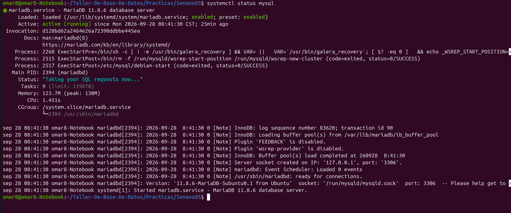

Comprobación del estado activo del servicio de MariaDB o MySQL mediante el comando en terminal (systemctl status).

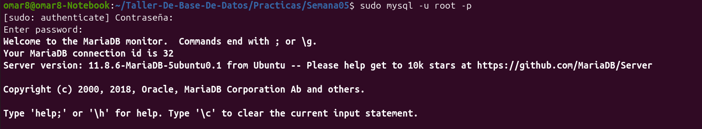

Acceso al cliente de la base de datos e inspección de la versión instalada con SELECT VERSION();.

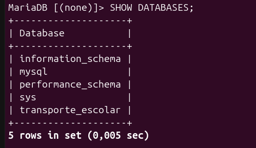

Visualización de las bases de datos existentes mediante SHOW DATABASES;.

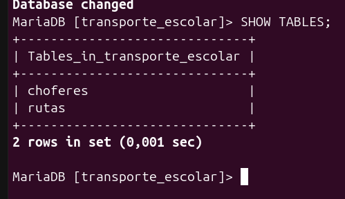

Listado de las tablas de la base de datos transporte_escolar usando SHOW TABLES;.

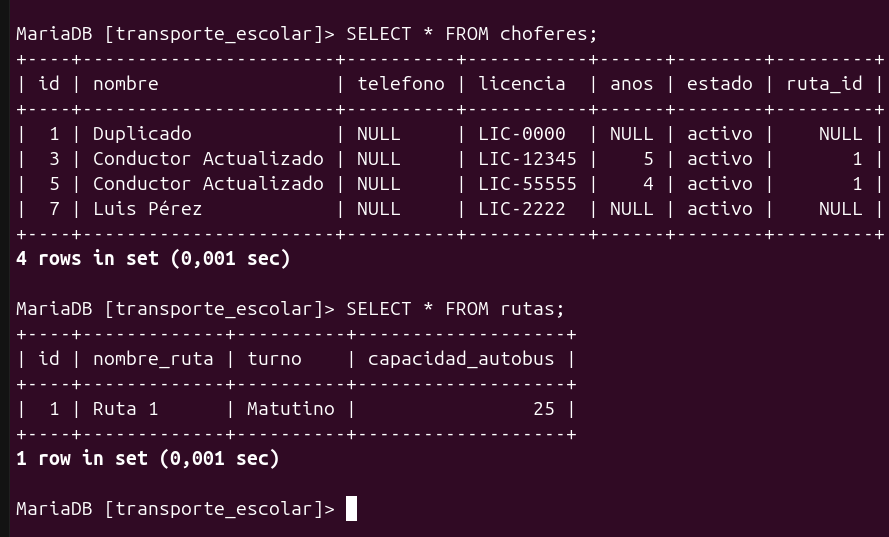

Consulta general de todos los registros de una tabla aplicando SELECT *.

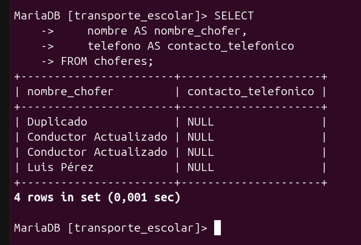

Proyección y despliegue de columnas específicas de los registros.

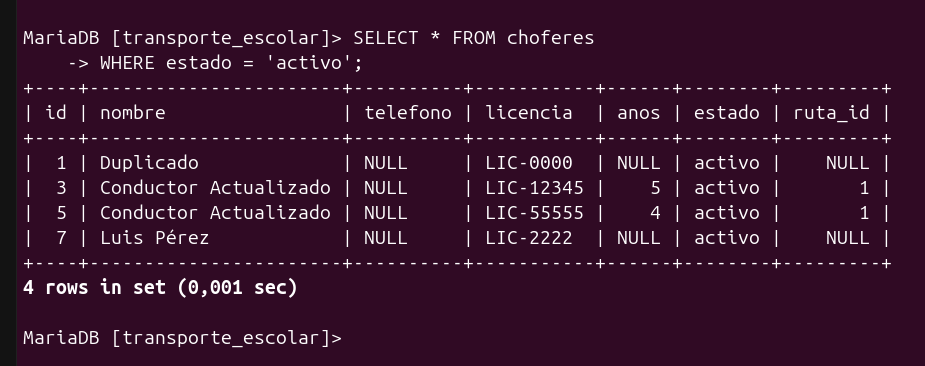

Aplicación de la cláusula de filtrado condicional WHERE.

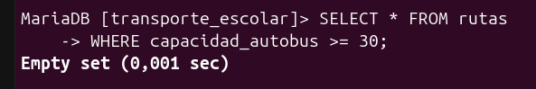

Uso de operadores de comparación numérica o de texto (>=, <, etc.).

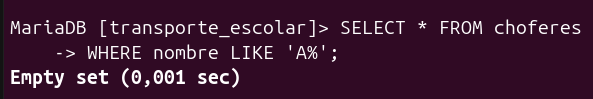

Búsqueda de patrones en campos de texto apoyándose en comodines.

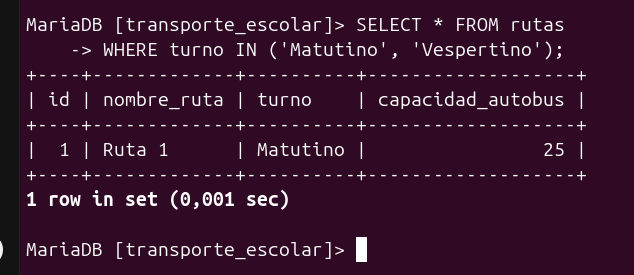

Filtrado de registros que coinciden dentro de una lista específica de opciones.

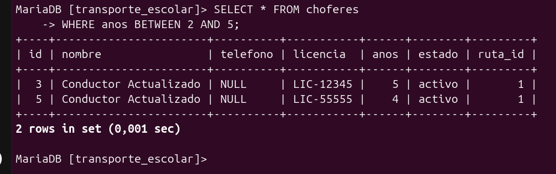

Consulta de datos acotados dentro de un rango determinado.

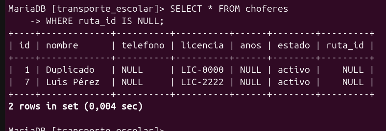

Localización de registros que contienen valores nulos (IS NULL).

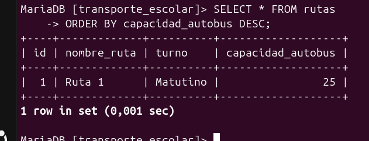

Presentación de resultados ordenados en forma descendente (ORDER BY DESC).

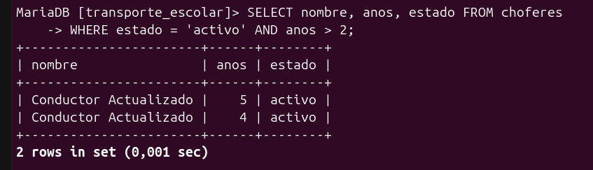

Combinación de dos o más condiciones simultáneas con el operador lógico AND.

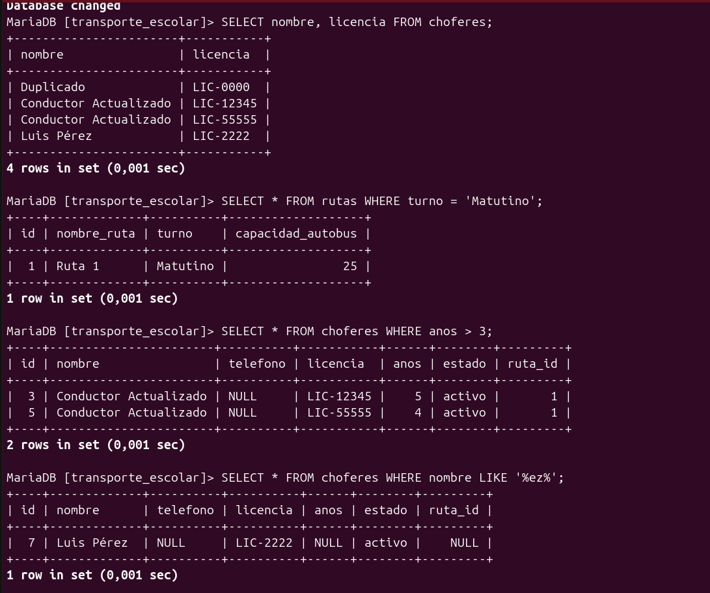

Pregunta 1 : Extracción de columnas específicas (nombre y licencia) de la tabla de choferes para mostrar únicamente la información esencial requerida por la dirección. 

Pregunta 2 : Filtrado de registros en la tabla de rutas utilizando un operador de igualdad (=) para localizar aquellas que operan exclusivamente en el turno matutino.

Pregunta 3 : Aplicación de un operador de comparación mayor que (>) para identificar a los choferes que cuentan con una experiencia laboral superior a 3 años.

Pregunta 4 : Búsqueda de patrones de texto utilizando el operador LIKE junto con comodines (%) para encontrar choferes cuyo nombre contiene un fragmento específico.

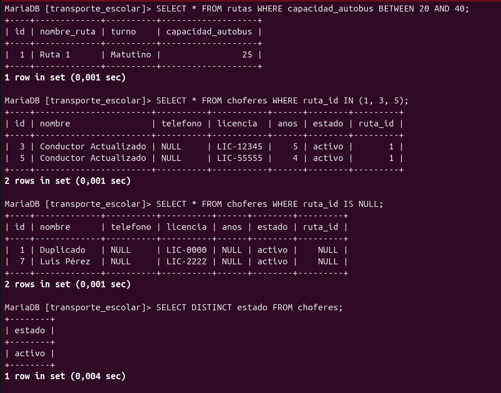

Pregunta 5 : Consulta acotada mediante el operador BETWEEN para obtener las rutas cuya capacidad de pasajeros se encuentra dentro de un rango numérico determinado. 

Pregunta 6 : Verificación de pertenencia a un conjunto cerrado utilizando el operador IN para listar choferes asignados a rutas específicas. 

Pregunta 7 : Identificación de registros con ausencia de datos mediante la cláusula IS NULL para detectar choferes que aún no tienen una ruta asignada. 

Pregunta 8 : Extracción de valores categóricos únicos utilizando DISTINCT para mostrar los diferentes estados de contratación posibles sin repetir filas. 

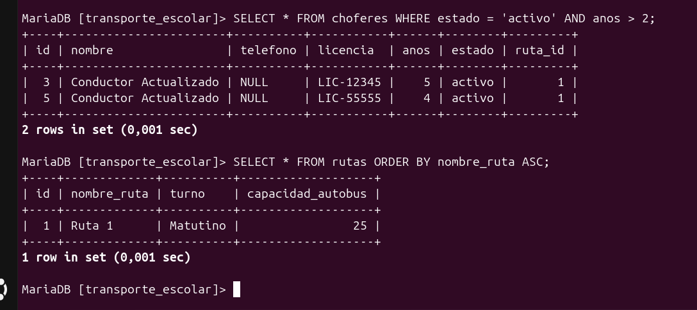

Pregunta 9 : Combinación de condiciones simultáneas con el operador lógico AND para filtrar choferes activos que además superan cierto nivel de experiencia. 

Pregunta 10 : Presentación de resultados ordenados alfabéticamente de forma ascendente (ORDER BY ASC) basándose en el nombre de las rutas.

